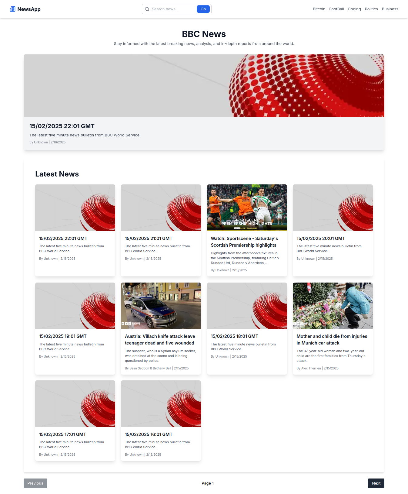
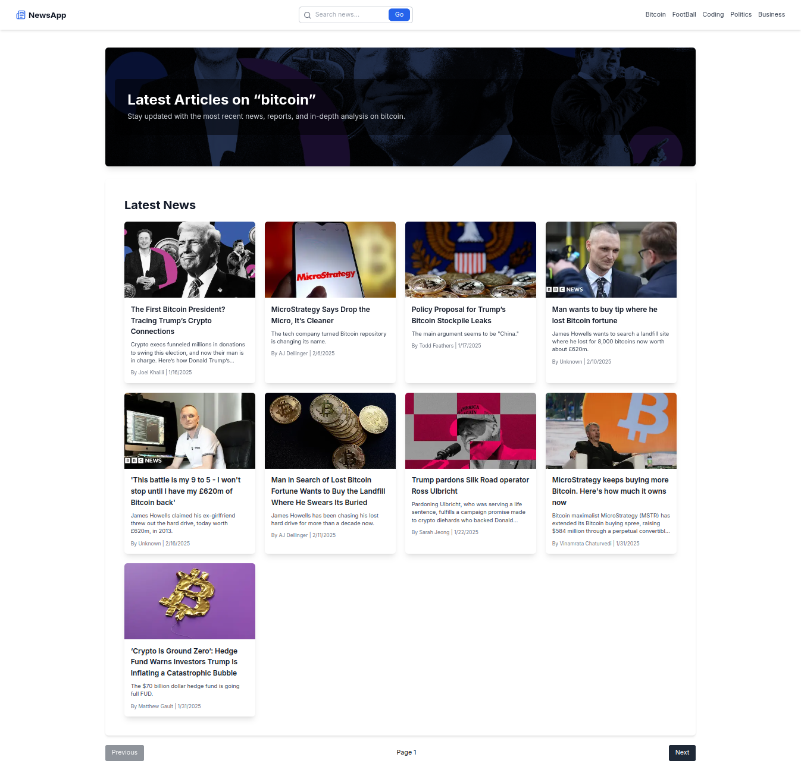

<div align="center">
  <h1>📰 News Explorer App</h1>
  <p>A modern news application built with Next.js 14, TypeScript, and Tailwind.</p>
</div>

---

## 🌟 About the Project

The **News Explorer App** is a powerful tool that allows you to search for the latest news articles on any topic of your choice. Whether you're interested in **technology, politics, sports, or entertainment**, this app fetches real-time news from trusted sources using the **News API**.

### Features:

✅ **Dynamic Search** – Enter any keyword to get the latest news related to your query.  
✅ **Pagination** – Easily navigate through multiple pages of results.  
✅ **Responsive Design** – Works seamlessly on desktops, tablets, and mobile devices.  
✅ **Direct Links** – Click on any article to open it in its original source website.  
✅ **Modern UI** – Built with Tailwind CSS for a sleek and professional look.

---

## Preview Of The Project

#### 1.Home Page with Latest News On the top



#### 2.Search Functionality with Pagination



## 🛠️ Getting Started

### Prerequisites

Before you begin, ensure you have the following installed:

- **Node.js (v16 or higher)**
- **npm or yarn**
- **A text editor (e.g., VS Code)**

### Installation

#### 1️⃣ Clone the Repository

```bash
git clone https://github.com/Henabakos/hacker-news.git
cd hacker-news
```

#### 2️⃣ Install Dependencies

```bash
npm install  # or yarn install
```

#### 3️⃣ Get Your API Key

- Visit [News API](https://newsapi.org/) and sign up for a free account.
- Generate an API key from your dashboard.

#### 4️⃣ Add API Key to `.env` File

Create a `.env` file in the root of the project and add:

```env
NEXT_PUBLIC_API_KEY=your_news_api_key_here
```

Example:

```env
NEXT_PUBLIC_API_KEY=st5f3bc0cea405b8c7be12345622
```

#### 5️⃣ Run the Application

```bash
npm run dev  # or yarn dev
```

Open [http://localhost:3000](http://localhost:3000) in your browser to view the app.

---

## 📖 How It Works

### 🔍 Search for Articles

- Enter a keyword (e.g., "technology", "politics", "sports") in the search bar.
- Click the **"Search"** button to fetch related articles.

### 📜 View Article Previews

- The app displays a list of articles with **titles, descriptions, images, and publication dates**.
- Each article is sourced from **reputable news outlets**.

### 🔗 Navigate to Original Source

- Click on any **article title or image** to open it in its original source website.
- This ensures you get the **full story** directly from the publisher.

### ⏩ Paginate Through Results

- Use the **pagination buttons** at the bottom to browse through multiple pages of results.

---

## 🧰 Technologies Used

- **Frontend Framework:** Next.js 14
- **State Management:** React Hooks (`useState`, `useEffect`)
- **Styling:** Tailwind CSS,
- **API Integration:** Axios, News API
- **Image Optimization:** Next.js Image Component

---

## 🤝 Contributing

Contributions are welcome! Follow these steps:

1. **Fork the repository**.
2. **Create a new branch**: `git checkout -b feature/new-feature`.
3. **Make changes and commit**: `git commit -m "Add new feature"`.
4. **Push to the branch**: `git push origin feature/new-feature`.
5. **Submit a pull request**.

---

## 📝 License

This project is licensed under the **MIT License**. See the [LICENSE](LICENSE) file for details.

---

## 👥 Contact

Have questions or feedback? Reach out:

- **Email:** henogato9876@gmail.com
- **GitHub:** [@Henabakos](https://github.com/Henabakos)

---

## 🙏 Acknowledgments

- Thanks to [News API](https://newsapi.org/) for providing access to real-time news data.
- Special thanks to the creators of **Shadcn UI** and **Tailwind CSS** for their awesome tools.

---

<p align="center">Made with ❤️ using Next.js & TailwindCss</p>
